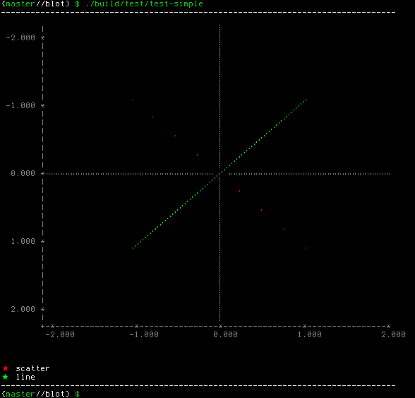
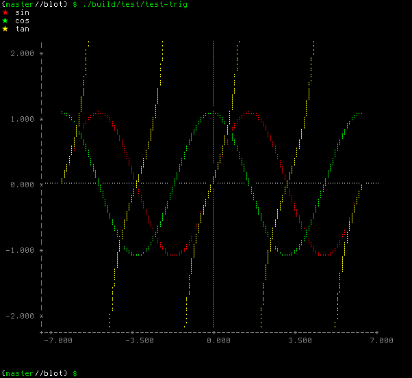

# blot

Blot is a plotting library written in C, that plots data onto the console.

## Noteworthy features:

  * plots to the console as text
  * very very fast (compared to python alternatives)
  * very very memory usage friendly
  * can plot multiple datasets on one canvas
  * uses familiar figure based API (similar to existing python plotting frameworks)
  * supports braille plotting (like [plotille](https://github.com/tammoippen/plotille))
  * 256 colour support

## Prerequisites:

blot was only tested on Debian Linux. It is built using standard tools.

        apt install make ninja cmake libglib2.0-dev

## Building:

blot is built using cmake and ninja.  There is a top level Makefile only to
simplify the build process (it invokes cmake in the `build` subdirectory).

        make

## Examples:

blot is being used in other projects as a library, but it comes with some
examples.

Generated from [test-simple.c](test/test-simple.c)

        ./build/test/test-simple

Generated from [test-trig.c](test/test-trig.c)

        ./build/test/test-trig

## Missing features:

  * different plotting modes like bar and histograms (currenlty only plots line/scatter)
  * draw axis lines, numbers and labels

### Ideas:

  * allow for swapping data from layer to allow for even faster plotting (allow blot to reuse existing allocated structures)
        * create a figure
        * all `blot_figure_scatter` multiple times, have it return the `blot_layer`
        * call `blot_figure_render` and `blot_screen_get_text`
        * then use `blot_layer_new_data` to swap the data
        * repeat with `blot_figure_render` and `blot_screen_get_text`

